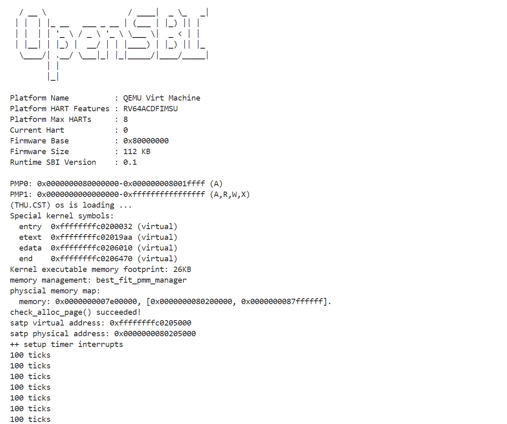

# Lab2：物理内存和页表
## 宋宣昊 2213781 计算机科学与技术
## 练习1：理解first-fit 连续物理内存分配算法（思考题）
first-fit 连续物理内存分配算法作为物理内存分配一个很基础的方法，需要同学们理解它的实现过程。请大家仔细阅读实验手册的教程并结合`kern/mm/default_pmm.c`中的相关代码，认真分析default_init，default_init_memmap，default_alloc_pages， default_free_pages等相关函数，并描述程序在进行物理内存分配的过程以及各个函数的作用。
请在实验报告中简要说明你的设计实现过程。请回答如下问题：
- 你的first fit算法是否有进一步的改进空间？

## 练习2：实现 Best-Fit 连续物理内存分配算法（需要编程）
在完成练习一后，参考kern/mm/default_pmm.c对First Fit算法的实现，编程实现Best Fit页面分配算法，算法的时空复杂度不做要求，能通过测试即可。
请在实验报告中简要说明你的设计实现过程，阐述代码是如何对物理内存进行分配和释放，并回答如下问题：
- 你的 Best-Fit 算法是否有进一步的改进空间？
### 设计实现过程：
1. 初始化（函数`best_fit_init`）：
- 创建一个空闲链表`free_list`，使用`list_init`函数初始化。
- 设置空闲页数`nr_free`为0，以便后续跟踪可用的页框数量。
2. 内存映射初始化（函数`best_fit_init_memmap`）：
- 接受两个参数：基础页框指针`base`和页数`n`。
- 遍历从`base`开始的`n`个页框，进行以下操作：
    - 确保每个页框标记为保留状态，表示尚未被分配。
    - 初始化每个页框的属性，清空标志位，并将引用计数设为0。
    - 对于第一个页框，设置其`property`为`n`，表示整个块的大小。其他页框的`property`在后续分配中会被使用。
- 将这个初始化好的空闲块添加到链表中：
    - 遍历链表，寻找合适的位置（基于地址顺序）插入该块。确保链表在插入后依然有序。
3. 页面分配（函数`best_fit_alloc_pages`）：
- 接收请求的页数`n`，首先检查是否有足够的空闲页框（`n`不能大于`nr_free`）。
- 使用`list_entry_t`遍历`free_list`：
    - 对于每个空闲块，检查其`property`是否大于等于请求的页数`n`。
    - 如果找到合适的空闲块，记录其地址，并判断是否是最佳适配（即最小满足条件的块）。
    - 在找到合适的块后，更新其状态：设置标志位（如`PG_reserved`），并更新其`property`，如果块的大小大于请求的页数，则计算剩余页框的数量并创建新块插入链表。
- 更新`nr_free`的值，减少空闲页框总数。
4. 页面释放（函数`best_fit_free_pages`）：
- 接收要释放的页框的基础地址`base`和页数`n`。
- 对每个页框进行重置操作，将标志位清空、引用计数设置为0。
- 更新释放块的属性，设置`property`为`n`，表示当前块的大小，并将块标记为空闲状态。
- 将释放的块插入到空闲链表中：通过遍历，找到适当位置以确保链表有序。
- 检查与相邻空闲块的合并：
    - 检查前一个块是否与当前块连续，如果是，合并并更新`property`。
    - 检查后一个块，类似的合并逻辑也要执行。

5. 合并逻辑：
- 在释放页框时，需要考虑合并：如果释放的块前面或后面有空闲块，检查它们是否连续。如果连续，则更新合并块的大小并删除相邻块的链表节点。

### 代码补充：
1. 函数`best_fit_init_memmap`：
```
    // 清空当前页框的标志和属性信息，并将页框的引用计数设置为0
    p->flags = 0;  // 重置页的标志
    set_page_ref(p, 0); // 设置引用计数为0
```
```
    // 1、当base < page时，找到第一个大于base的页，将base插入到它前面，并退出循环
    if (base < page) {
        list_add_before(le, &(base->page_link));
        break;
    }
    // 2、当list_next(le) == &free_list时，若已经到达链表结尾，将base插入到链表尾部
    if (list_next(le) == &free_list) {
        list_add(le, &(base->page_link));
    }
```
2. 函数`best_fit_alloc_pages`：
```
    // 遍历空闲链表，查找满足需求的空闲页框
    // 如果找到满足需求的页面，记录该页面以及当前找到的最小连续空闲页框数量
    while ((le = list_next(le)) != &free_list) {
        struct Page *p = le2page(le, page_link);
        // 如果找到一个合适的块并且小于当前最小块
        if (p->property >= n && p->property < min_size) {
            page = p; // 更新当前找到的最佳页面
            min_size = p->property; // 更新最小块大小
        }
    }
```

3. 函数`best_fit_free_pages`：
```
    // 具体来说就是设置当前页块的属性为释放的页块数、并将当前页块标记为已分配状态、最后增加nr_free的值
    base->property = n; // 设置当前页块的属性为释放的页块数
    SetPageProperty(base); // 标记为已释放状态
    nr_free += n; // 增加可用页数
```
```
    if (p + p->property == base) {
        p->property += base->property; // 合并大小
        ClearPageProperty(base); // 清除当前块的属性标记
        list_del(&(base->page_link)); // 从链表中删除当前块
        base = p; // 更新指针指向合并后的块
    }
```
### 物理内存分配和释放：
1.  物理内存的初始化
在系统启动时，物理内存会通过`best_fit_init`和`best_fit_init_memmap`函数进行初始化。

- `best_fit_init`：
  - 创建并初始化一个空闲链表`free_list`，以便后续进行内存块的管理。
  - 设置`nr_free`为0，表示当前没有可用的内存页框。

- `best_fit_init_memmap`：
  - 接收一个基地址指针`base`和一个页数`n`，用于初始化一块连续的内存块。
  - 遍历`base`开始的`n`个页框，确保每个页框的状态正确。
  - 初始化每个页框的属性：
    - 如果是第一个页框，将`property`设置为`n`，表示整个块的大小。
    - 清空标志位，并将引用计数设置为0，表示这些页框当前是空闲的。
  - 将初始化的内存块插入到`free_list`中，保持链表的有序性。

2.  物理内存的分配
当有进程请求分配内存时，使用`best_fit_alloc_pages`函数来处理。

- `best_fit_alloc_pages`：
  - 首先检查请求的页数`n`是否超过当前的可用页数`nr_free`，如果超过则返回`NULL`，表示分配失败。
  - 遍历`free_list`，寻找最适合的空闲块：
    - 对于每个块，检查其`property`（可用页数）是否大于等于请求的`n`，同时寻找最小的满足条件的块。
    - 一旦找到合适的块，更新其状态：
      - 设置`PG_reserved`标志，表示该块已被分配。
      - 如果找到的块大于请求的块，则计算剩余部分的大小，并创建一个新块来保存剩余的页框。
      - 更新`nr_free`，减少当前可用的页框数量。

3.  物理内存的释放
当一个进程不再需要某块内存时，可以通过`best_fit_free_pages`函数释放它。

- `best_fit_free_pages`：
  - 接收要释放的页框的基础地址`base`和页数`n`。
  - 遍历从`base`开始的`n`个页框，进行以下操作：
    - 清空每个页框的标志位，将引用计数设置为0，表示这些页框现在是空闲的。
    - 将释放的块的`property`设置为`n`，表示当前块的大小，并标记为已分配状态。
  - 将释放的块插入到空闲链表`free_list`中：
    - 确保插入后链表仍然有序，使用`list_add_before`将释放的块放到合适的位置。
  - 尝试合并相邻的空闲块：
    - 检查释放的块前面是否有连续的空闲块，如果有，则将其合并，更新合并后块的大小。
    - 同样检查后面的块，确保合并后空闲块的状态正确。
### 运行截图：

### 改进空间：
1.  分配策略改进
- 多级分配：可以考虑采用多级分配策略，首先尝试在小块中寻找合适的内存，避免在大块中进行不必要的搜索。这有助于减少搜索时间，尤其是在空闲块较多的情况下。

2.  使用堆
- 堆数据结构：将空闲块存储在堆数据结构（如优先队列或最小堆）中，以加快查找最小合适块的速度。这样可以在对空闲块进行操作时减少时间复杂度。

3.  合并策略优化
- 延迟合并：在释放内存时，暂时不进行合并，而是标记为“待合并”，定期进行合并操作。这可以减少频繁合并带来的性能损失，尤其是在内存使用较为频繁的场景中。

4.  内存碎片管理
- 合并小块：在空闲链表中定期检查并合并小块，以减少内存碎片的产生。可以设置阈值，将小于一定大小的块合并为一个较大的块。

5.  动态调整
- 动态策略调整：根据运行时的内存使用情况动态调整分配策略。例如，当发现内存碎片增多时，可以切换到其他分配算法（如First Fit或Next Fit）。

6.  基于块的管理
- 块大小调整：对不同大小的请求，可以动态调整块的大小，避免过多的小块和大块之间的浪费。

7.  页面大小调整
- 可变页面大小：支持可变页面大小的分配，根据需求动态调整页面大小，以提高内存的使用效率。
## 扩展练习Challenge：硬件的可用物理内存范围的获取方法（思考题）
  - 如果 OS 无法提前知道当前硬件的可用物理内存范围，请问你有何办法让 OS 获取可用物理内存范围？

